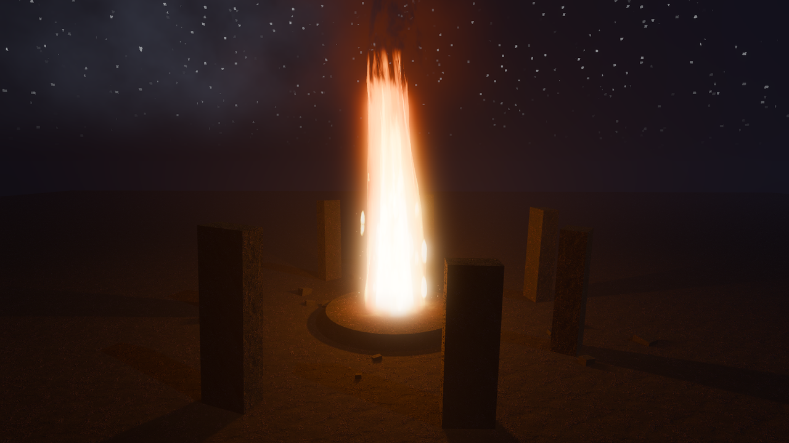
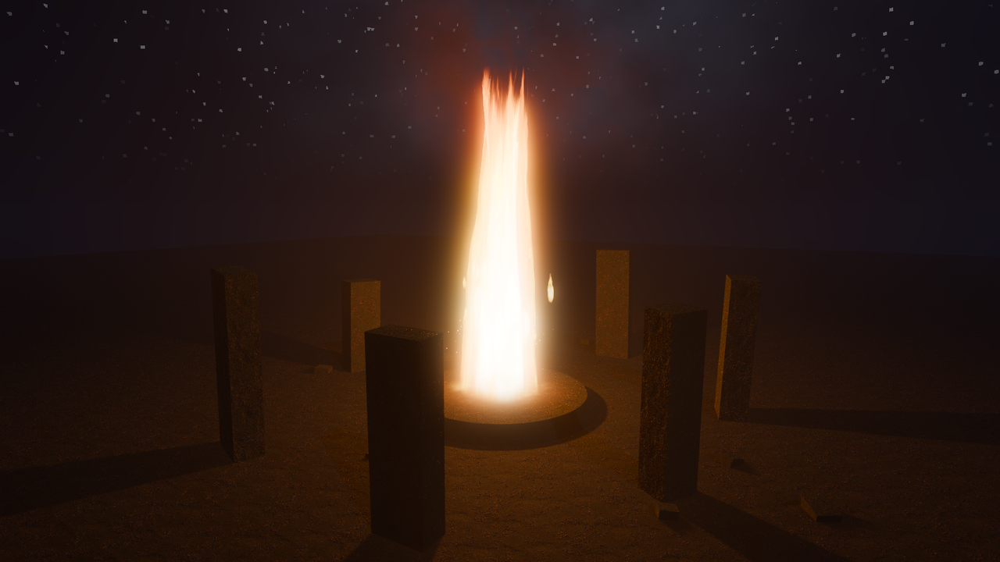
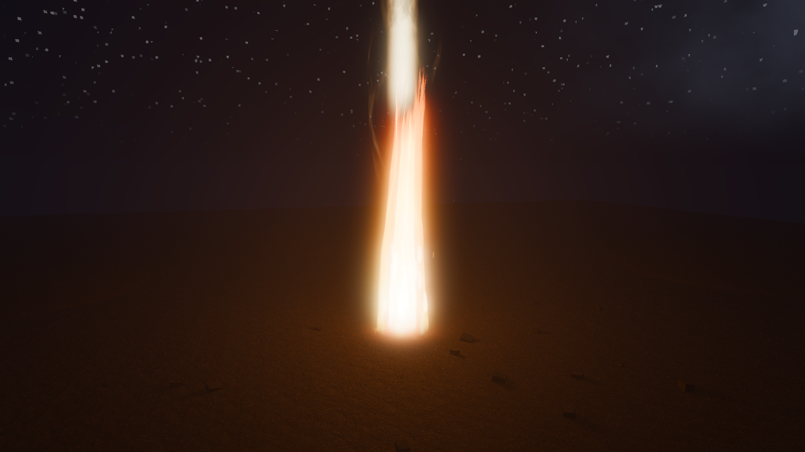
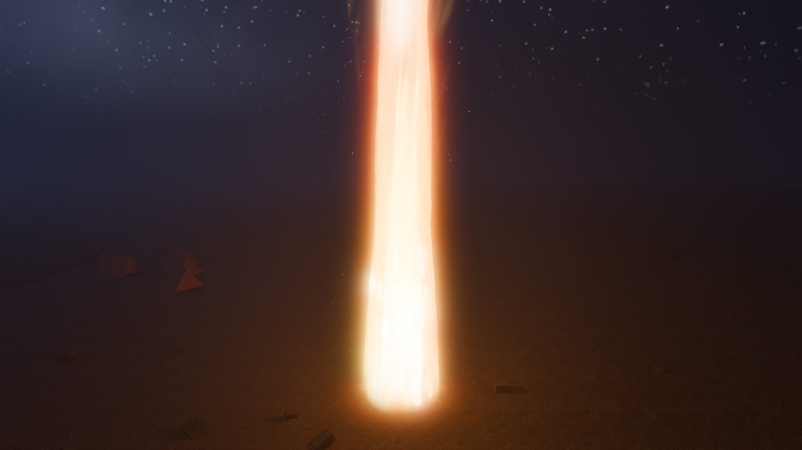
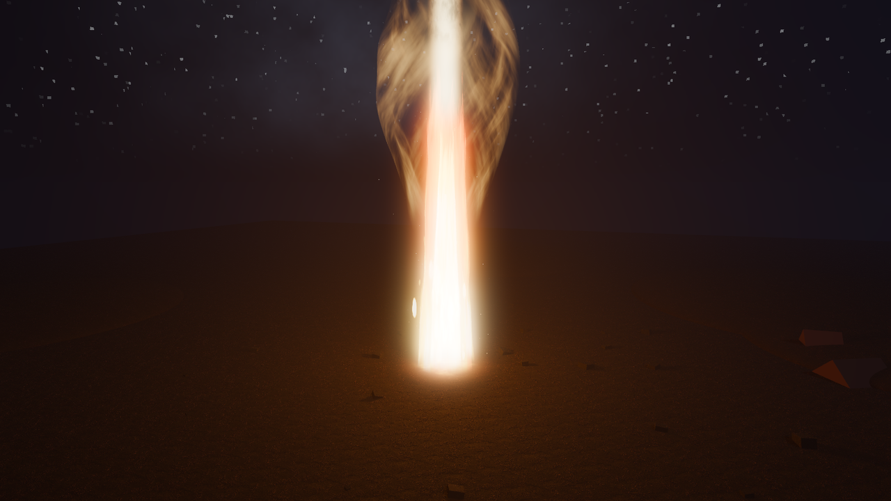
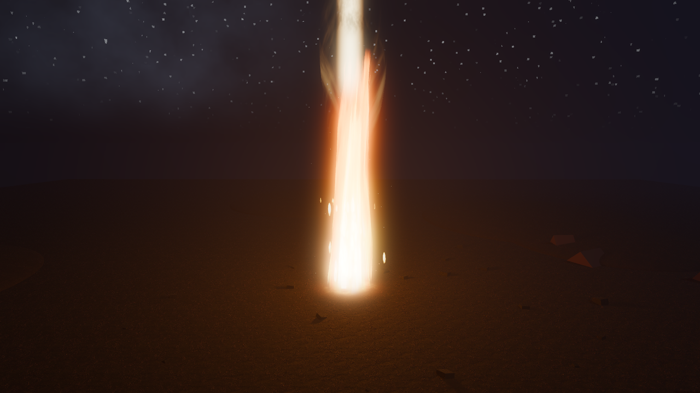
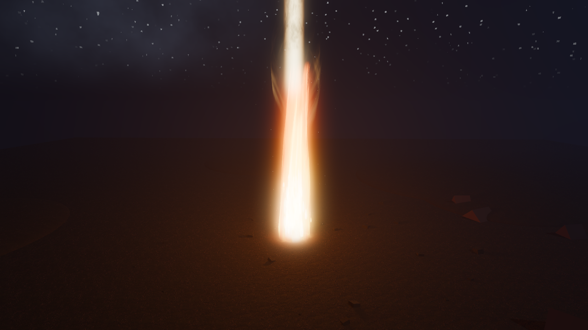
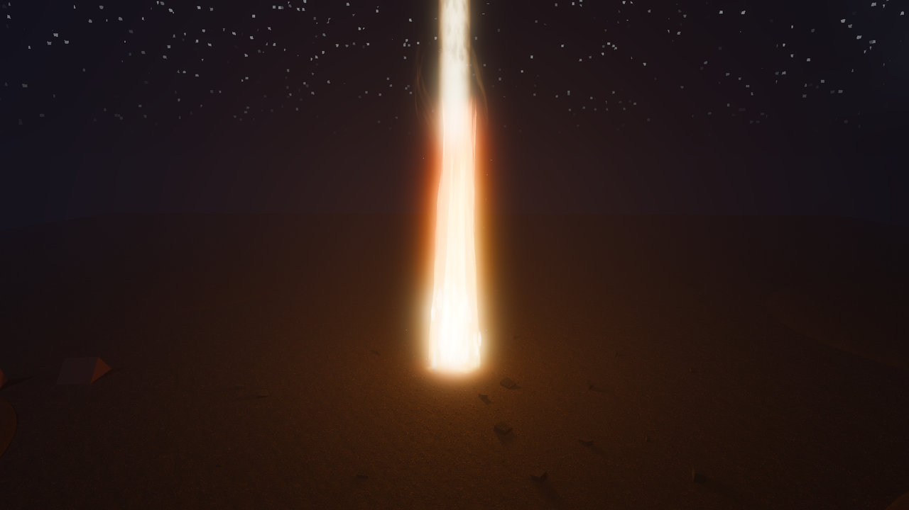

# Godot Effects

**Two self-contained visual effects for Godot 4, written to be lifted into another project:
a 30 metre volumetric pillar of fire, and a Minecraft-style voxel water system.**

Both are built on the Forward+ renderer with C# on .NET. Eleven hand-written shaders, about
twenty simulation classes behind interface seams, and a demo scene for each.



<details>
<summary><b>More captures of the pillar of fire</b> (seven more)</summary>

<br>















</details>

---

## Pillar of fire

A stylized pillar of fire for a night scene. The flame column rises into a god beam reaching
toward the sky, wrapped in a slowly swirling luminous glory cloud, with embers below and slow
ascending motes along its whole height. Two flickering shadow-casting lights plus a far-reaching
fill light make the surroundings breathe with it, including occasional surges.

**Using it in your game.** Copy the `fire/` folder into your project and instance
`res://fire/pillar_of_fire.tscn`. Everything (shaders, particles, lights, the flicker script) is
self-contained. Tune it through:

- `pillar_of_fire.gd` exports: light energies, flicker, swell and surge strength, colors.
- `flame_column.gdshader` params on the `FlameOuter` and `FlameCore` materials: `height`,
  `base_radius`, erosion, sway, palette.
- `glory_beam.gdshader` and `glory_cloud.gdshader` params: beam reach, cloud shroud shape
  and intensity.

The heat-shimmer layer reads the screen texture (opaque pass only), which is why it sits above
the flame body rather than inside it.

**Demo:** `demo/main.tscn`, a wilderness night camp with a starfield sky, moonlight, desert
ground, dune mounds, scattered rocks and an arc of tents. Drag to orbit, wheel to zoom, Space
toggles auto-rotate.

---

## Voxel water

Water with discrete levels that spreads, falls and dries, plus a classifier that tags every cell
as calm, river or waterfall so the renderer, foam, spray and audio all react without being told.
Build with water and it reclassifies live.

- **Calm:** flat, translucent, screen-space-reflective, with depth colour and shoreline foam.
- **River:** water spreading down a stepped channel as flowing rapids.
- **Waterfall:** aerated white falls with voxel foam cubes and GPU mist at the plunge pool.
- Swimming and buoyancy, an underwater pass, an ice brush, and four quality tiers.

**The seam is the point.** The whole module lives in `water/` (namespace `RAEngine.Water`) and
references only `Godot` core types and `System.*`, so it compiles unchanged in a host project.
The single integration point is the `IVoxelWorld` interface. `water/PORTING.md` is the guide for
dropping it into another codebase, file by file.

Everything under `sandbox/` is the throwaway harness that exercises it: a tiny voxel world,
cameras and build tools. It is not meant to be ported.

**Demo:** `water_demo/water_demo.tscn`. Its own [README](water_demo/README.md) has the full
control list and the camera jumps to the lake, waterfall and river.

> **No gallery images yet.** The existing water captures are engineering QA frames with a debug
> HUD over a bare test box, so none are published here. They will be replaced with real captures.

---

## Requirements

- **Godot 4.6.x, .NET / Mono build.** The shaders use `instance uniform` and the fire demo uses
  volumetric fog, so the renderer must be Forward+ (Mobile also works for the fire).
- **.NET 8 SDK.**

```
C:\Godot\Godot_v4.6.3-stable_mono_win64_console.exe --path .
```

---

## Layout

```
fire/          pillar of fire: scene, flicker script, 8 shaders
demo/          fire demo scene (wilderness night camp) + night sky shader
water/         the portable water module (RAEngine.Water) + PORTING.md
water_demo/    water demo scene + water shaders
sandbox/       throwaway harness for the water demo, not for porting
assets/        the one third-party texture, see Credits
docs/images/   the curated captures used in this README
```

---

## Credits

Ground and rock textures: [rocky_terrain_02](https://polyhaven.com/a/rocky_terrain_02) from
Poly Haven, CC0. That is the only third-party asset in this repository.

## License

[MIT](LICENSE), covering the shaders, scripts and scenes. The Poly Haven texture above stays
under its own CC0 terms.
