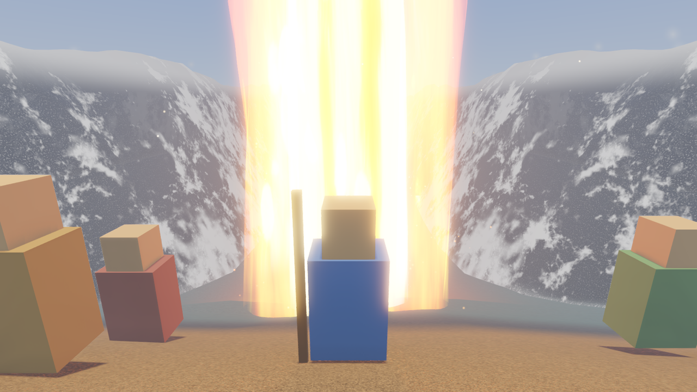
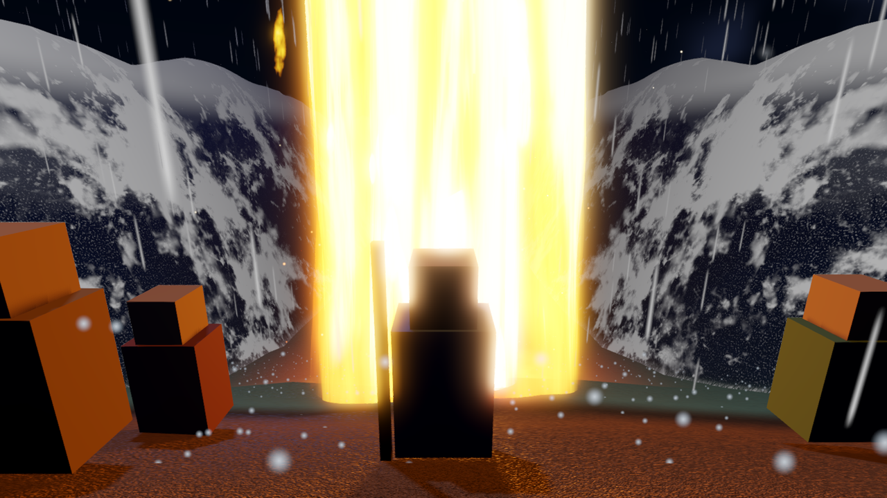
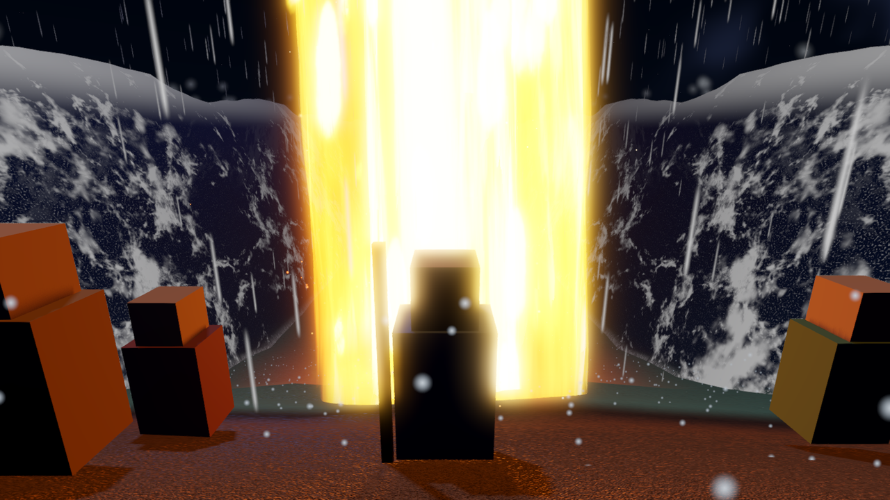
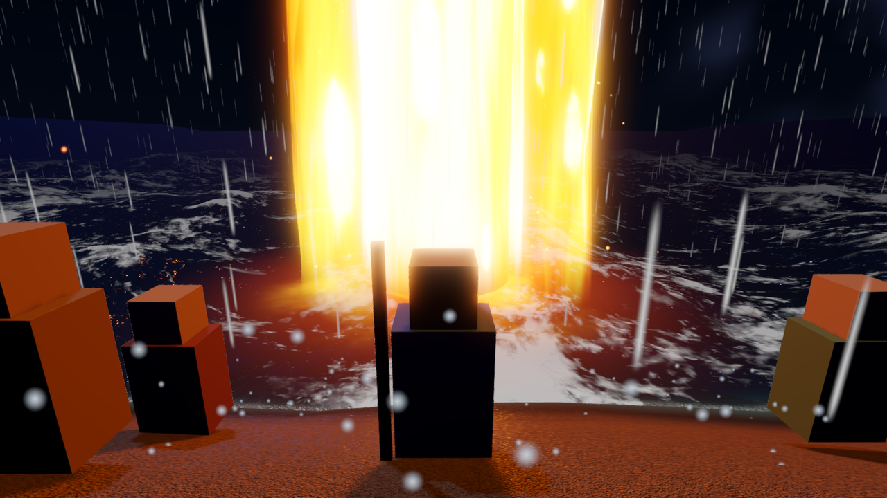

# Godot Effects

**Three self-contained visual effects for Godot 4, written to be lifted into another project:
a parting sea with towering walls of water, a 30 metre volumetric pillar of fire, and a
Minecraft-style voxel water system.**

All three run on the Forward+ renderer. Fourteen hand-written shaders plus six GLSL compute
kernels, about twenty simulation classes behind interface seams, and a demo scene for each.


<details>
<summary><b>More captures of the pillar of fire</b> (seven more)</summary>

<br>


</details>

---

## Parting sea

One heavily subdivided plane, displaced in the vertex stage into a continuous cross-section:
flat open sea, curving down into a dry trough, rising into towering walls, settling back to open
sea. One surface, so there are no seams to hide. A single `part` uniform drives the whole
transition from 0 to 1.



The waves come from the [GodotOceanWaves](https://github.com/2Retr0/GodotOceanWaves) FFT
simulation (MIT, see Credits). Its compute cascades publish displacement and normal textures as
shader globals; the water shader samples them for displacement, slope and whitecap foam, then
tapers them to roughly zero inside the dry corridor and on the steep cliff faces so the walls
stay coherent instead of dissolving into chop.

Two details worth reading the shader for, both explained in its header:

- **The walls sample by along-corridor Z and world Y, not world XZ.** On a near-vertical face
  the XZ coordinate barely changes with height, so an XZ lookup would smear a single texel
  column up the entire wall.
- **`depth_draw_always`, not `depth_prepass_alpha`.** The water is one transparent mesh, and
  transparent surfaces do not write depth, so the distant open sea painted straight over the
  nearer wall. Writing depth in the transparent pass lets the walls occlude what is behind them.
  A depth prepass would have polluted the depth texture the absorption reads and zeroed the
  water column.

<details>
<summary><b>More captures</b> (night storm, before and after)</summary>

<br>







</details>

The scene also carries a day and night mood system, an analytic CPU height field that mirrors
the GPU basin so a walker stays planted on displaced ground, and wall mist, splash and drowning
effects.

**Demo:** `red_sea/red_sea_demo.tscn`. WASD to walk, hold RMB to look, wheel to zoom.
`E` parts and closes the sea, `N` cross-fades clear noon to stormy night with rain and
lightning, arrow keys move the pillar of fire, `P` freezes the wave simulation and `]` / `[`
step it one frame at a time, `H` hides the tuning panel and help text for clean captures.

**Note on the ground.** The original build used a purchased photo-scanned sand and sea-floor
PBR set, and a pack of scanned rock props. Neither can be redistributed, so this version
generates its ground maps with FastNoiseLite and ships no rocks. Point `_make_ground_mat` at
your own textures if you want photographic ground.

---

## Pillar of fire

A stylized pillar of fire for a night scene. The flame column rises into a god beam reaching
toward the sky, wrapped in a slowly swirling luminous glory cloud, with embers below and slow
ascending motes along its whole height. Two flickering shadow-casting lights plus a far-reaching
fill light make the surroundings breathe with it, including occasional surges.

**Using it in your game.** Copy the `fire/` folder into your project and instance
`res://fire/pillar_of_fire.tscn`. Everything (shaders, particles, lights, the flicker script) is
self-contained. Tune it through:

- `pillar_of_fire.gd` exports: light energies, flicker, swell and surge strength, colors.
- `flame_column.gdshader` params on the `FlameOuter` and `FlameCore` materials: `height`,
  `base_radius`, erosion, sway, palette.
- `glory_beam.gdshader` and `glory_cloud.gdshader` params: beam reach, cloud shroud shape
  and intensity.

The heat-shimmer layer reads the screen texture (opaque pass only), which is why it sits above
the flame body rather than inside it.

**Demo:** `demo/main.tscn`, a wilderness night camp with a starfield sky, moonlight, desert
ground, dune mounds, scattered rocks and an arc of tents. Drag to orbit, wheel to zoom, Space
toggles auto-rotate.

---

## Voxel water

Water with discrete levels that spreads, falls and dries, plus a classifier that tags every cell
as calm, river or waterfall so the renderer, foam, spray and audio all react without being told.
Build with water and it reclassifies live.

- **Calm:** flat, translucent, screen-space-reflective, with depth colour and shoreline foam.
- **River:** water spreading down a stepped channel as flowing rapids.
- **Waterfall:** aerated white falls with voxel foam cubes and GPU mist at the plunge pool.
- Swimming and buoyancy, an underwater pass, an ice brush, and four quality tiers.

**The seam is the point.** The whole module lives in `water/` (namespace `RAEngine.Water`) and
references only `Godot` core types and `System.*`, so it compiles unchanged in a host project.
The single integration point is the `IVoxelWorld` interface. `water/PORTING.md` is the guide for
dropping it into another codebase, file by file.

Everything under `sandbox/` is the throwaway harness that exercises it: a tiny voxel world,
cameras and build tools. It is not meant to be ported.

**Demo:** `water_demo/water_demo.tscn`. Its own [README](water_demo/README.md) has the full
control list and the camera jumps to the lake, waterfall and river.

> **No gallery images yet.** The existing water captures are engineering QA frames with a debug
> HUD over a bare test box, so none are published here. They will be replaced with real captures.

---

## Requirements

- **Godot 4.6.x, .NET / Mono build.** The shaders use `instance uniform` and the fire demo uses
  volumetric fog, so the renderer must be Forward+ (Mobile also works for the fire).
- **.NET 8 SDK.**

Each effect has its own scene, so pass the one you want:

```
godot --path . res://red_sea/red_sea_demo.tscn
godot --path . res://demo/main.tscn          # pillar of fire
godot --path . res://water_demo/water_demo.tscn
```

---

## Layout

```
red_sea/       parting sea: world script, mood presets, demo scene, 3 shaders
addons/        GodotOceanWaves FFT simulation (MIT, see Credits)
fire/          pillar of fire: scene, flicker script, 8 shaders
demo/          fire demo scene (wilderness night camp) + night sky shader
water/         the portable water module (RAEngine.Water) + PORTING.md
water_demo/    water demo scene + water shaders
sandbox/       throwaway harness for the water demo, not for porting
assets/        the one third-party texture, see Credits
docs/images/   the curated captures used in this README
```

---

## Credits

**GodotOceanWaves.** The FFT ocean-wave simulation under `addons/ocean_waves/` (the compute
shaders and the `RenderingContext`, `WaveGenerator` and `WaveCascadeParameters` scripts) is
derived from [GodotOceanWaves](https://github.com/2Retr0/GodotOceanWaves) by Ethan Truong,
copyright 2024, used under the MIT License. Only the simulation is used; that project's mesh,
surface material and spray are not. The `compute/*.glsl` files were lightly modified for Godot
4.6 (dropped `readonly` qualifiers on bound storage resources).

**Textures.** Ground and rock textures in the fire demo:
[rocky_terrain_02](https://polyhaven.com/a/rocky_terrain_02) from Poly Haven, CC0. Everything
else is generated at runtime.

## License

[MIT](LICENSE), covering the shaders, scripts and scenes written for this repository. The
GodotOceanWaves code under `addons/ocean_waves/` is MIT under its own copyright, and the Poly
Haven texture stays under its own CC0 terms. See Credits.
